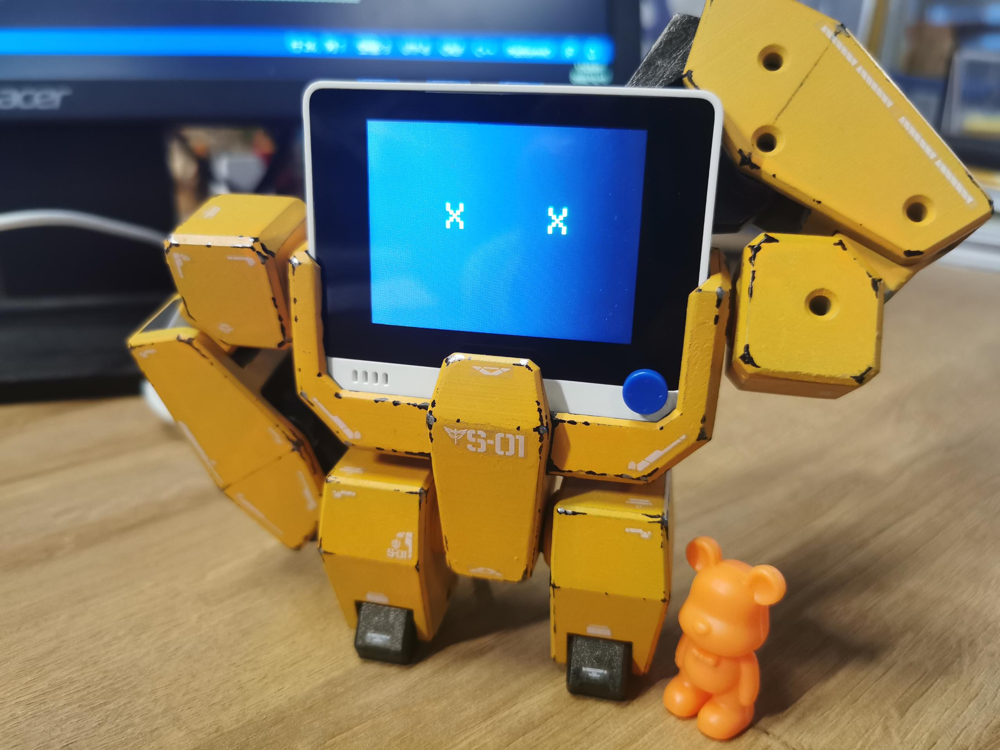

# Wio Terminal Root Stand

## Introduction

Thanks to [Nosk Wu](https://www.hackster.io/nosk/make-a-coooool-wio-terminal-robot-stand-c002af) from hackster.io. for building an interesting 3D printing robot shape stand to enhance the viewing of Wio Terminal! Adorable idea!

<div align=center></div>

## Getting Started

We provide some expression examples that are displayed on Wio Terminal to show you how to program with LCD on the Wio Terminal. Meanwhile, we will use the buttons on the board to achieve image switching.

### Materials Required

The material required here is only the Wio Terminal. The assembles of 3D printing components you can find [here](https://www.hackster.io/nosk/make-a-coooool-wio-terminal-robot-stand-c002af).

#### Hardware Required

- [Wio Terminal](https://www.seeedstudio.com/Wio-Terminal-p-4509.html)

<div align=center></div>

#### Software Required

- [Arduino](https://www.arduino.cc/en/software)

If this is the first time you use Wio Terminal with Arduino, it is highly recommanded to check ["Getting started"](https://wiki.seeedstudio.com/Wio-Terminal-Getting-Started/) wiki to understand how to upload codes to the board.

### Step 1. Pull up the Configurable Buttons

This is the example about using buttons on the board.

>**Note**: `WIO_KEY_A`, `WIO_KEY_B` and `WIO_KEY_C` are defined for the Wio Terminal configurable buttons.

```c++
void setup()
{
   pinMode(WIO_KEY_A, INPUT_PULLUP);
   pinMode(WIO_KEY_B, INPUT_PULLUP);
   pinMode(WIO_KEY_C, INPUT_PULLUP);
}
```

The result is something like:

{tu}

### Step 2. Initialize the TFT LCD Screen

To initialise the TFT LCD screen on Wio Terminal,and to display the sentence: Wio terminal is funny ! !

```c++
#include"TFT_eSPI.h"

TFT_eSPI tft;
 
void setup() 
{
  ...
  tft.begin();
  tft.setRotation(3);
  tft.fillScreen(TFT_BLACK); // Fills the screen with BLACK background
  tft.setTextColor(TFT_GREEN); // sets the text colour to green
  tft.setTextSize(2);
  tft.drawString("Wio terminal is funny ! !", 15, 90); // prints strings from (15, 90)
  ...
}
```

### Step 3. Draw Character and Text Strings

- To draw `Character` on TFT LCD screen.

```c++
void loop()
{
    tft.fillScreen(TFT_BLACK); // BLACK background
    tft.drawChar(90, 90, '>', TFT_GREEN, TFT_GREEN, 4);  // Draw a green character A from (90,90)
    tft.drawChar(210, 90, '<', TFT_GREEN, TFT_GREEN, 4); // Draw a green character B from (210,90)
}
```

- To draw `Text Strings` on TFT LCD screen.



```c++
void loop()
{
    tft.fillScreen(TFT_BLACK);   // BLACK background
    tft.setTextColor(TFT_GREEN); // sets the text colour to green
    tft.setTextSize(4);
    tft.drawString("X    X ", 95, 90); // prints strings from (95, 90)
}
```

### Step 4. Use if statement to select the expression

```c++
if (digitalRead(WIO_KEY_A) == LOW)
   {
        ...
   }
```

### Example code

```c++
#include <Arduino.h>
#include "TFT_eSPI.h"

TFT_eSPI tft;

void setup()
{

   pinMode(WIO_KEY_A, INPUT_PULLUP);
   pinMode(WIO_KEY_B, INPUT_PULLUP);
   pinMode(WIO_KEY_C, INPUT_PULLUP);

   tft.begin();
   tft.setRotation(3);
   tft.fillScreen(TFT_BLACK);                           // Fills the screen with BLACK background
   tft.setTextColor(TFT_GREEN);                         // sets the text colour to green
   tft.setTextSize(2);
   tft.drawString("Wio terminal is funny ! !", 15, 90); // prints strings from (15, 90)
}

void loop()
{

   if (digitalRead(WIO_KEY_A) == LOW)
   {

      tft.fillScreen(TFT_BLACK);                           // BLACK background
      tft.drawChar(90, 90, '>', TFT_GREEN, TFT_GREEN, 4);  // Draw a green character A from (90,90)
      tft.drawChar(210, 90, '<', TFT_GREEN, TFT_GREEN, 4); // Draw a green character B from (210,90)
   }
   else if (digitalRead(WIO_KEY_B) == LOW)
   {
      tft.fillScreen(TFT_BLACK);         // BLACK background
      tft.setTextColor(TFT_GREEN);       // sets the text colour to black
      tft.setTextSize(4);
      tft.drawString("0    0 ", 95, 90); // prints strings from (95, 90)
   }
   else if (digitalRead(WIO_KEY_C) == LOW)
   {
      tft.fillScreen(TFT_BLACK);         // BLACK background
      tft.setTextColor(TFT_GREEN);       // sets the text colour to green
      tft.setTextSize(4);
      tft.drawString("X    X ", 95, 90); // prints strings from (95, 90)
   }
} 
```

## Tech support

Please submit any technical issues into our [forum](https://forum.seeedstudio.com/)<br /><p style="text-align:center"><a href="https://www.seeedstudio.com/act-4.html?utm_source=wiki&utm_medium=wikibanner&utm_campaign=newproducts" target="_blank"></a></p>
